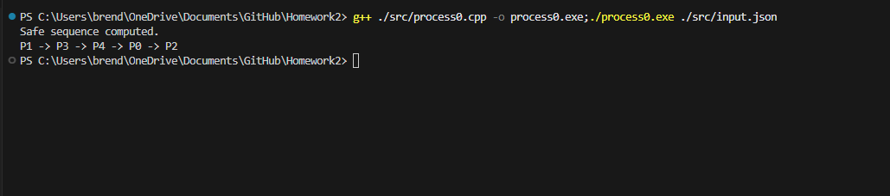

# Documentation

### Brendan Valleau
### CS-OS 10/17/2025
### Homework 1
  

  

## Compile Instructions

  

  

**Step 1:** Open a split terminal, or have two separate terminals, both in the correct path (Starting Directory in Homework1)

  

  

**Step 2:** Run the command to compile c++ files:

  

`g++ ./src/consumer.cpp -o ./compiled/consumer; g++ ./src/producer.cpp -o ./compiled/producer`

  

 **Step 3:**

  

 **Run the producer first in either terminal:**

  

  `./compiled/producer`

  

 **In the other terminal, start the consumer:**

  

 `./compiled/consumer`

  
  **Another way of executing:**
  `./compiled/producer & ./compiled/consumer &` 
   Hit enter once finished to terminate (does this automatically with split terminals)

  

And so, the output will be the resulting input from the producer file. Examples of proper execution include the following:

  

  

  

  

### Implementation

  

Using the standard C libraries, I used pthreads, shared memory, and a semaphore to implement the producer-consumer problem. For the data structure, I just had two `int`s, in & out, and a `int[2]` buffer to hold data. When initializing the shared data in the producer process, the address ptr is initialized to my data type.  I then detach the shared memory, and allow another thread to access. The first thread to access it is the first iteration of the producer method, called as a blocking wait from the main thread, waiting for it to finish. The producer writes a `1` to the buffer, increments the `in` data structure to `(in + 1) % 2`, Mod the size to account for a circular buffer.  And then the producer posts to the semaphore, allowing the consumer method to enter it's critical section while accessing the shared memory segment. In the consumer thread, it immediately calls `sem_wait()`,  waiting for the first producer to finish and post to the semaphore. Once this happens the thread enters it's critical process, reads from the structure, increments the `out` integer, the same as above, and exits the thread. Only the producer calls `sem_post()`, and only the consumer calls `sem_wait()`.

  

#### My struggles, Approach, and proccess:

My first goal was to figure out which standard library I should use. I had some include issues with the `std::counting_semaphore`, and I began to try using the older c `semaphore.h` library. I ran into trouble several times figuring out the proper way to make use of the library. I started to check each call against the error value `-1` or the macro `SEM_FAILED`.  As the producer and consumer process are very similar, I spent most time debugging in the producer process and then copied over the working code into the consumer file and made the proper adjustments.

  

Once I began to understand how to use this library, I then began working on implementing my threading for the producer process. I had to once again, determine which library I should approach threading with, and decided on pthreads. They were the most straightforward for me to use, or at least in my personal opinion. I didn't run into too many bugs with the threading, other than figuring out I needed to pass a struct for multiple arguments.

  

Using shared memory was also a struggle, however through the painful process of debugging shared memory with the `ipcs` and `ipcrm` and the `errno` macros, I painstakingly figured out how to properly use the shared memory.